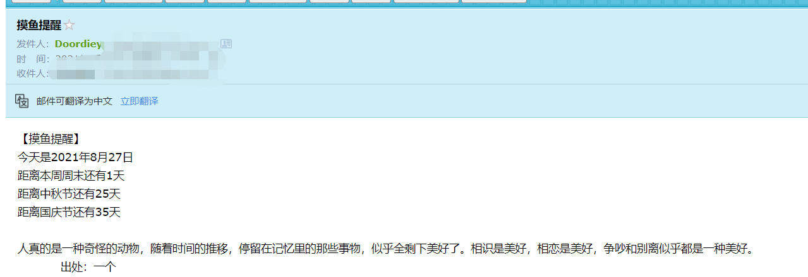

# 邮件提醒

> 起因：收到一条摸鱼信息
>
> ```txt
> 【摸鱼办公室】
> 8月25日 
> 下午好，摸鱼人，工作再累，一定不要忘记摸鱼哦 
> 有事没事起身去茶水间去厕所去廊道走走，别老在工位上坐着，钱是老板的，但命是自己的
> 距离本周周末还有3天
> 距离中秋假期还有25天
> 距离国庆假期还有37天
> 距离跨年假期还有128天
> 距离春节假期还有159天
> ```
>
> 经过：感觉蛮有意思的，可以搞一个玩玩，搞成每日推送啥的
>
> 结果：开发中

## 一、服务器脚本自动发送邮件

### 1.服务器发送邮件

```shell
#centos7 下载mailx
yum -y install mailx

#配置相关信息
vim etc/mail.rc

#添加如下内容
set from=`发件人邮箱`(`显示出来的发件人名称`)
set smtp=smtps://smtp.163.com:465  `发件的服务器地址`
set smtp-auth-user=`发件人邮箱`
set smtp-auth-password=`认证密码`
set smtp-auth=login
set ssl-verify=ignore
set nss-config-dir=/etc/pki/nssdb

#发送内容
mail -s "subject" user@xxx.com    #发送方式一：只有主题

echo "content" | mail -s "subject" user@xxx.com    #发送方式二：有内容和主题

mail -s "subject" user@xxx.com < content.txt   #发送方式三：将文件内容当成内容发送
```

### 2.自动发送脚本编写

> 好像没啥特别的，就是发送一下，按照上面提到的发送方式三。后续结合收件人列表进行更新

```shell
vim mailfish.sh
```

具体的脚本，目前就是一个发送

```sh
#!/bin/bash
mail -s "摸鱼提醒" <./content/fish.txt 
```

- 说明：当前目录结构
  - mail
    - content
      - `fish.txt`
    - users
      - `user.txt`
    - `mailfish.sh`

## 二、文本内容变化及收件人

> 该部分内容计划使用python脚本实现

### 1.文本内容变化

> 主要两个部分，一个是劝人摸鱼的话，一个是一些倒计时。
>
> 增加图片，以字符图形式。实现参考文档[Python图片生成字符画](https://zhuanlan.zhihu.com/p/81899232)。

#### 内容正文变化

> 劝人摸鱼的话，肯定得爬虫，那么去哪里跑？
>
> 目前想法：
>
> - 微博
> - 知乎
> - 百度
> - 名人名言？

最终实现：爬取[一个](http://wufazhuce.com/)。

```python
def GetInfo(url):
    headers = {"content-type": "application/json",
               "User-Agent": 'Mozilla/5.0 (X11;Ubuntu;Linux x86_64; rv:22.0) Gecko/20100101 Firefox'}
    page = requests.get(url, headers=headers).text
    print("爬到了以下信息：")
    bsText = BeautifulSoup(page, "html.parser")
    word = bsText.find_all('div', class_="fp-one-cita")[0].a.contents[0] + "\n"
    pictureURL = bsText.find_all('img', class_="fp-one-imagen")[0]['src']
    PicText = HandlePic(pictureURL)
    return word, PicText
```


#### 倒计时时间变化

```python
def BuildContent(word, PicText):
    title = "【摸鱼提醒】\n"
    today = datetime.datetime.now()
    Today = "今天是" + str(today.year) + "年" + str(today.month) + "月" + str(today.day) + "日\n"
    Weekday = "距离本周周末还有" + str(6 - today.weekday()-1) + "天\n"
    OtherHappy = ""
    HappyFile = "./HappyDay.txt"
    f = open(HappyFile, 'r', encoding='UTF-8')
    for s in f.readlines():
        that = datetime.datetime.strptime(s.split(',')[0], '%Y-%m-%d')
        dayname = s.split(',')[1].replace("\n", "")
        OtherHappy += "距离" + dayname + "还有" + str((that-today).days+1) + "天"
        OtherHappy += "\n"
    f.close()
    HappyContent = title + Today + Weekday + OtherHappy + "\n" + word + "           出处：一个\n" + PicText
    return HappyContent
```

### 2.收件人列表

> 收件人邮箱都记录在`users/user.txt`内，获取，然后遍历。

#### 基于该功能改进脚本

```sh
while read LINE;
 do mail -s "摸鱼提醒"  $LINE <./content/fish.txt;
done   < ./users/user1.txt
```

说明：`user1.txt`中，逐行记录收件人邮箱地址

### 3.定时执行

```shell
#创建定时任务
crontab -e
#任务
0 14 * * 1-5 source /root/mail/mailfish.sh      
```

## 三、改进优化

- 会被认为是垃圾邮件、发不出去，待优化。
- 图片由于爬取图片太高清，处理有问题，待优化。

## 四、实现效果

### 20210827



